## 解决的问题：

- 返回值信息改成 中文
- 空指针处理
- 关于异常的统一处理
- 时间格式
- 公共参数的配置

# swagger-spring-boot-starter


#### 大神可以直接跳过。

### 背景

前后分离的项目都很流行用 swagger。但是写起来很麻烦。需要配置一大堆东西。

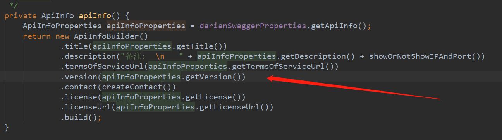

你需要配置 Token，或者 语言 （国际化需要） 等参数时，需要配置很多东西。

**主要是一些参数的设置。还有 IP 端口的显示。** 

这东西，配的每个人都很烦。有的人 copy 来 copy 去的。

我当时是因为想要加接口的校验规则，才看了看 swagger。

> 像我这种人，这种东西，我配置一遍，copy 一次，我就嫌多。然后呢，今天，用了四个小时就写了一个 swagger 的 starter。
>
> 莫喷。就是提供了一些，swgger 的外部化配置的功能。哈哈哈哈

### 版本

- JDK 8 +
- spring boot 2.1.0
- swagger 2.7.0

> 版本不兼容问题。自己就去解决吧。

我建议你，把这个项目下载下来，因为你可以改吧改吧，想加什么功能，自己就搞吧。

如果想要看 demo

这个就是我 [demo 的仓库地址](https://github.com/Darian1996/example-swagger-spring-boot-starter)  

你 install 以后 **GAV** 设置成你改过以后的，不想改。那就直接把我的 [**example-swagger-spring-boot-starter**](https://github.com/Darian1996/example-swagger-spring-boot-starter) 项目下载下来，跑一跑也行。

### 注意

在你的启动类上，加上：`@EnableDarianSwagger ` 

然后，直接 **run** 起来。

### 彩蛋

#### IP 端口：

cmd 的 ipconfig 命令懒得看？ 前后台联调懒得说话？

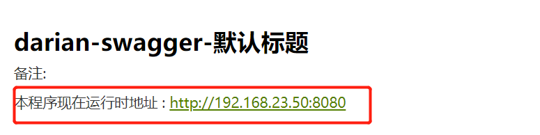

是不是很 fashion?

```properties
# 是否显示 IP 和端口
#darian.swagger.api-info.show-ip-and-port=false
```

如果你配置了 false 就不显示了。

#### BaseResponse 返回类型不明确？


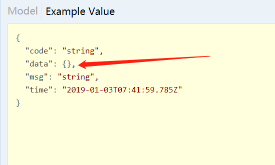

##### 统一参数以后，要设置泛型！！！！！

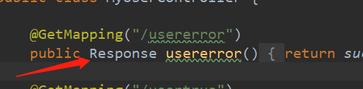

##### 设置泛型以后  返回值的例子，立马变了。有没有。哈哈哈哈

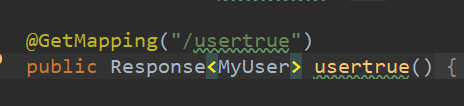

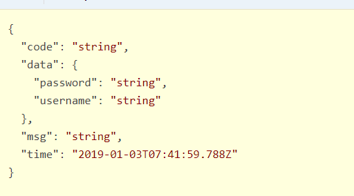


可以配置你的 controller 扫描的包等。自己去看吧。哈哈哈


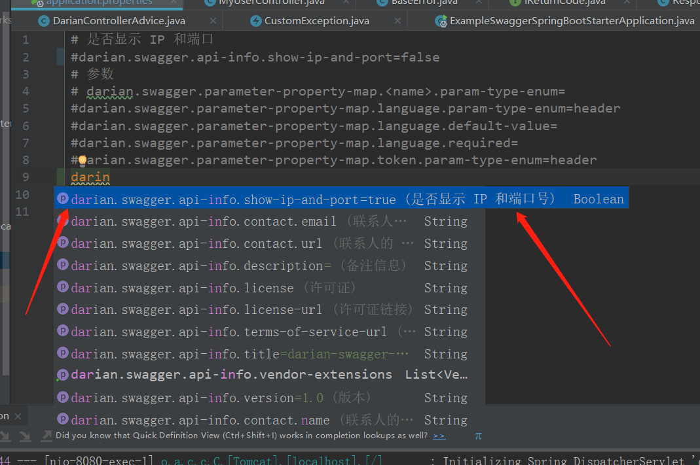

提示什么都有。如果，这都不会，对不起。我也教不会你了。

### 返回错误信息改成中文

关于验证参数的返回值。

**如果你没有设置语言。我会用 中文。！！！不要问我为什么。我就想用中文！！！** 

`@NotNull` 注解加上以后。

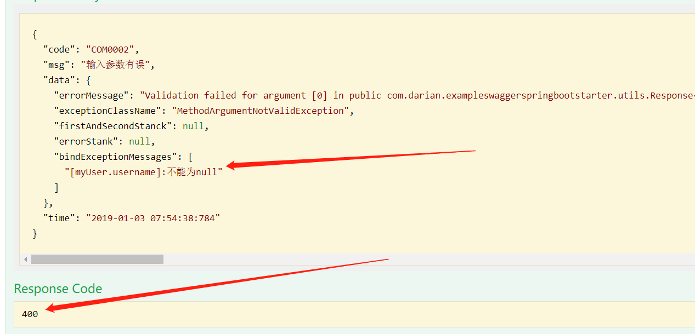

返回值变了。400 （这个请看 RESTful 规范）

看我的 错误信息，是不是中文。

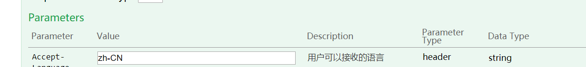

我把 语言改成 `en`


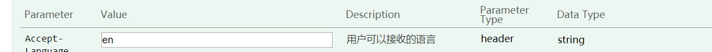


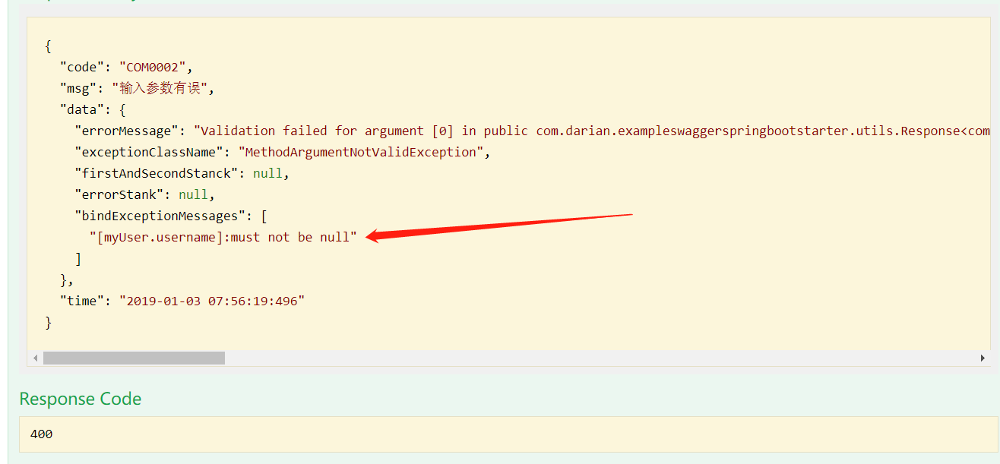

立马变成英文了，有没有很神奇。


### 空指针处理

你有没有遇到过空指针？

看我的项目吧。

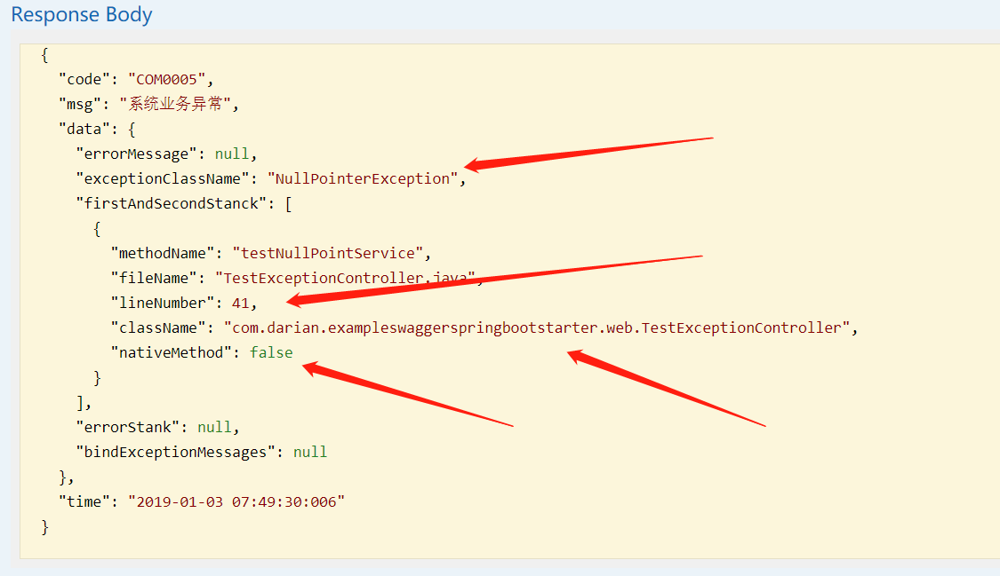

**类型，行数，异常类型。这你都找不到你的 BUG 。 我也没办法了！！！** 


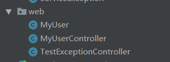

我的 `DTO` 和 `Controller` 写在了一块，我明确告诉你，我懒的分开！！！

写一个 demo 项目教什么真！！！你写项目分开就行了！！

### 关于异常

```java
public class CustomException extends RuntimeException {

    /***
     *
     * when you use the method,
     * exceptionMessage while show on app and pop
     * {@link ServiceException)}
     * Example:
     * {
     *     code: "0005",
     *     msg: message,
     *     data: {...},
     *     time: xxxxxxxxxx
     * }
     *
     * @param message
     */
    public static ServiceException ServiceException(String message) {
        return new ServiceException(new IReturnCode() {});
    }

    /***
     * <p>when you use this method ,
     * <p>exceptionMessage while show on returndata.errorMessage
     * <p>"系统业务异常" while pop on app
     * <p>{@link ServiceException}
     * <p>While return
     * <p>{
     * <p>    code: "0005",
     * <p>    msg: "系统业务异常",
     * <p>    data: {
     * <p>      errorMessage: message,
     * <p>      exceptionClassName: ThisRuntimeException.className,
     * <p>    },
     * <p>    time: xxxxxxxx
     * <p>}
     *
     * @param message
     */
    public static RuntimeException RuntimeException(String message) {
        return new RuntimeException(message);
    }

    /***
     *
     * {@link CustomerReturnCode}
     * @param customerReturnCode
     * @return
     */
    public static ServiceException ErrorCode(CustomerReturnCode customerReturnCode) {
        return new ServiceException(customerReturnCode);
    }
}
```

是不是很爽，只需要这一个异常，你可以想干什么干什么。怎么搞都行。

为了代码间接，我添加了 默认实现。

```java
/***
 * @author Darian
 */
public interface IReturnCode extends Serializable {
    String CURRENT_APP_SYSTEM_ID = "ALL";

    default String getCode() {
        return "All2011";
    }

    default String getMsg() {
        return "系统业务异常";
    }
}
```

关于我异常堆栈的处理，请看  [`DarianControllerAdvice`](https://github.com/Darian1996/example-swagger-spring-boot-starter/blob/master/src/main/java/com/darian/exampleswaggerspringbootstarter/utils/DarianControllerAdvice.java) 类。 


看我错误处理时 [`BaseError`](https://github.com/Darian1996/example-swagger-spring-boot-starter/blob/master/src/main/java/com/darian/exampleswaggerspringbootstarter/utils/BaseError.java) 类。


你自定义的 验证类 想要加国际化，自己百度百度，一大堆。

### 时间格式

时间格式，你们前台后台就约定好格式，只有一种格式。

举个例子，生日，你们这边显示 `年月日` ，这百年显示 `年月日，时分秒` 你们怎么搞？

放弃吧。Bug 多，都是 `瞎搞` 搞出来的。

只有两种选择。

- 年月日，时分秒
- 时间戳


我特别想吐槽一句，兵熊一个，将熊熊一窝，一个总的 Leader 的设计不怎么样，坑的不是一个人，而是所有的开发都是怎么搞都搞不定。


从设计层面，要简化开发。才能实现高扩展啊！！！！

> 比如说那种，时间段的存储，
>
> 有几天的，有几分的，有几秒的.
>
> 听我的，放弃他，你只存最小的单位就好了。
>
> 假如说你的单位最小是秒。那就全部存成秒。前台他展示，想怎么变化，怎么变化，你的接收，和传出只有秒！！！
>
> 如果你喜欢写一大堆的 `if... else...` 
>
> 你喜欢。我无所谓。哈哈哈哈


统一！！！只有简化的统一的规范才能够提高开发的效率。

请注意我的措辞！

- 统一
- 简化
- 规范


### 公共参数的配置

```properties
# 是否显示 IP 和端口
#darian.swagger.api-info.show-ip-and-port=false
# 参数
# darian.swagger.parameter-property-map.<name>.param-type-enum=
#darian.swagger.parameter-property-map.language.param-type-enum=header
#darian.swagger.parameter-property-map.language.default-value=
#darian.swagger.parameter-property-map.language.required=
#darian.swagger.parameter-property-map.token.param-type-enum=header
darin
# 日期格式
spring.jackson.date-format=yyyy-MM-dd HH:mm:ss:SSS
```

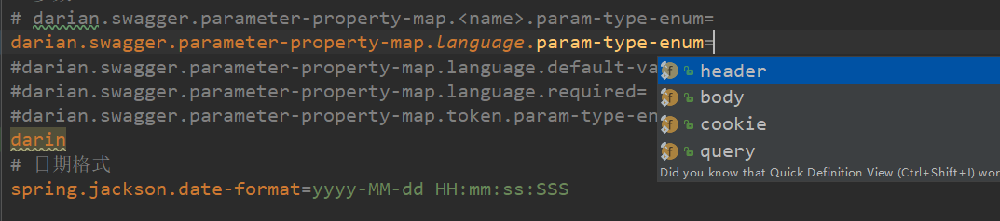

看到吗？我的种类都给你枚举类都设置好了！！！


## 有关知识

- i18n  国际化相关
- httpstatus  HTTP 协议相关
- CustomreService  异常相关
- Response   统一返回值相关
- IReturnCode    java 8 提供的默认实现相关。
- 策略模式


## 结语

​	不想手写 swagger 了。就用这个吧，很少很少的功能，还是提供的。如果你的版本不支持，自己照着改。

​	是不是有些名字都不知道？ 国际化等等。？ 放弃吧，JAVA 真的太难了。发现很多不会？


哈哈哈哈


##### 生命苦短，放弃 JAVA！！！

##### 拒绝 Copy ，多多设计！！！


